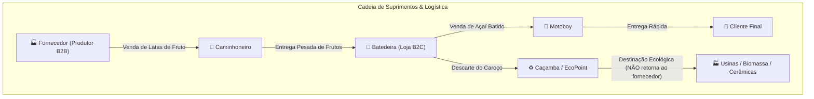
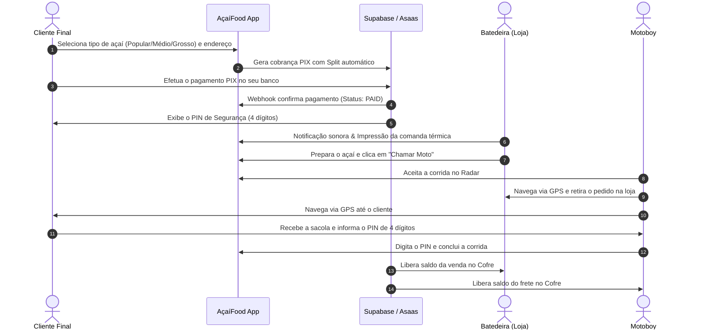
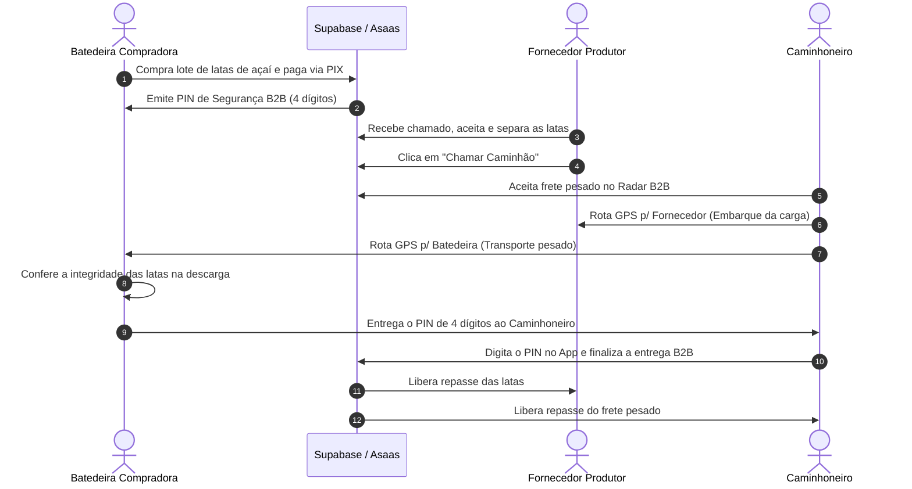
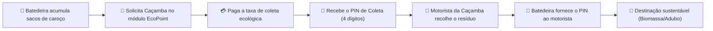

# 📘 Manual Mestre e Relatório Completo do Ecossistema AçaíFood
**Versão:** 2.0 • **Ano:** 2026  
**Plataforma Oficial:** [https://www.acaifood.app.br/](https://www.acaifood.app.br/)  
**Espelho de Produção:** [https://acai-food-mobile.vercel.app/](https://acai-food-mobile.vercel.app/)

---

## 📑 Sumário Executivo
1. [Visão Geral da Arquitetura](#1-visão-geral-da-arquitetura)
2. [Matriz de Perfis e Responsabilidades](#2-matriz-de-perfis-e-responsabilidades)
3. [Ciclo de Vida B2C: Consumidor Final & Batedeira](#3-ciclo-de-vida-b2c-consumidor-final--batedeira)
4. [Ciclo de Vida B2B: Batedeira & Fornecedor de Frutos](#4-ciclo-de-vida-b2b-batedeira--fornecedor-de-frutos)
5. [Ciclo de Vida da Logística Urbana (Motoboy)](#5-ciclo-de-vida-da-logística-urbana-motoboy)
6. [Ciclo de Vida do Transporte Pesado (Caminhão / Caçamba)](#6-ciclo-de-vida-do-transporte-pesado-caminhão--caçamba)
7. [Ciclo de Vida da Logística Reversa & EcoPoint (Sustentabilidade)](#7-ciclo-de-vida-da-logística-reversa--ecopoint-sustentabilidade)
8. [Mecanismo Universal de Segurança por PIN (4 Dígitos)](#8-mecanismo-universal-de-segurança-por-pin-4-dígitos)
9. [Sistema Financeiro: Checkout Asaas, Split Automático e Saques PIX](#9-sistema-financeiro-checkout-asaas-split-automático-e-saques-pix)
10. [Governança, Painel Administrativo e Auditoria de Segurança](#10-governança-painel-administrativo-e-auditoria-de-segurança)

---

## 1. Visão Geral da Arquitetura

O **AçaíFood** é uma plataforma integrada de tecnologia, logística e economia circular dedicada à cadeia de valor do açaí na Amazônia. A arquitetura une:

- **Frontend & App PWA:** Next.js 16 (App Router, Turbopack, React 19, Tailwind CSS, Lucide Icons).
- **Backend & Realtime:** Supabase (PostgreSQL com RLS, Realtime Subscriptions, RPCs Atômicas e Service Role).
- **Gateway de Pagamento & Split:** Asaas API v3 (Cobranças PIX com padrão EMV-Co BACEN, Webhooks e Liquidação de Subcontas).
- **Roteamento & Geoprocessamento:** Leaflet, OpenStreetMap, OSRM Routing e Web Geolocation API.

> **📌 Nota Importante de Cadeia de Valor:** O **Fornecedor/Produtor** é exclusivamente o vendedor do fruto fresco colhido e **NÃO recebe ou precisa receber o caroço de volta**. O caroço processado pela batedeira é recolhido por caminhões caçamba e encaminhado diretamente para indústrias de biomassa, olarias/cerâmicas, adubagem e ecopontos de reciclagem sustentável.

---

## 2. Matriz de Perfis e Responsabilidades

| Perfil | Rota do Painel | Atuação Principal |
| :--- | :--- | :--- |
| **Cliente** | `/` | Escolha de açaí, pagamento via Pix, rastreio de moto e validação de PIN na porta. |
| **Batedeira (Loja)** | `/parceiros/batedeira` | Venda de açaí batido, preparo com comanda térmica, compra B2B de latas e descarte de caroços. |
| **Fornecedor** | `/parceiros/fornecedor` | Venda no atacado de latas de açaí recém-colhidas para abastecimento de lojas. |
| **Motoboy** | `/parceiros/motoboy` | Entregas urbanas B2C com navegação GPS em 2 pernas (Retirada e Entrega) e validação de PIN. |
| **Caminhoneiro** | `/parceiros/caminhao` | Transporte pesado de latas (B2B) e coletas de resíduos (Caçambas/EcoPoint). |
| **Administrador** | `/admin` | Configuração de taxas municipais, auditoria financeira, aprovação de contas e monitoramento geral. |

---

## 3. Ciclo de Vida B2C: Consumidor Final & Batedeira

---

## 4. Ciclo de Vida B2B: Batedeira & Fornecedor de Frutos

As batedeiras necessitam de grandes volumes de matéria-prima (latas de 14kg ou sacas de 60kg). O fluxo B2B automatiza o pedido, frete pesado e retenção do pagamento.

---

## 5. Ciclo de Vida da Logística Urbana (Motoboy)

O motoboy conta com uma interface projetada para agilidade no trânsito e máxima clareza:

1. **Radar em Tempo Real:** Alertas sonoros e visuais de novas corridas com distância exata em km e valor líquido a receber.
2. **Aceitação Atômica:** Utiliza a RPC PostgreSQL `accept_order_atomic`, impedindo que dois entregadores aceitem a mesma rota simultaneamente.
3. **Navegação em Duas Etapas:**
   - **Etapa 1 (🚀 GPS p/ Retirada):** Rota direta no Google Maps/Waze até a loja parceira.
   - **Etapa 2 (🏁 GPS p/ Cliente):** Rota direta com dados do cliente e ponto de referência.
4. **Chat Integrado:** Botão direto para conversar com a loja ou cliente em caso de dúvidas.
5. **Conferência de PIN:** Finalização obrigatória mediante código de 4 dígitos.

---

## 6. Ciclo de Vida do Transporte Pesado (Caminhão / Caçamba)

Desenvolvido para transportadores autônomos de carga pesada e operadores de caçamba:

- **Fretes B2B:** Transporte de grandes volumes de frutos entre produtores rurais, portos fluviais e batedeiras urbanas.
- **Tabela Diferenciada:** Tarifação por km rodado ou taxa fixa para caminhões, calculada com base no tipo de veículo cadastrado (Caminhão ou Caçamba).
- **Navegação OSRM:** Mapa com visualização da distância total e coordenadas de carga e descarga.

---

## 7. Ciclo de Vida da Logística Reversa & EcoPoint (Sustentabilidade)

Mais de 85% do fruto do açaí é composto pelo caroço. O módulo **EcoPoint** resolve o passivo ambiental das cidades:

---

## 8. Mecanismo Universal de Segurança por PIN (4 Dígitos)

O protocolo de PIN é o núcleo anti-fraude do AçaíFood em todas as operações:

| Tipo de Transação | Quem gera e possui o PIN? | Quem digita e valida o PIN? | O que acontece após a validação? |
| :--- | :--- | :--- | :--- |
| **B2C (Venda de Açaí)** | 👤 Cliente Residencial | 🛵 Motoboy | Libera o pagamento da batedeira e o frete do motoboy. |
| **B2B (Lote de Frutos)** | 🏪 Batedeira Compradora | 🚚 Caminhoneiro | Libera o valor das latas para o produtor e o frete pesado. |
| **EcoPoint (Resíduos)** | 🏪 Batedeira Solicitante | 🚛 Motorista de Caçamba | Confirma a coleta física e liquida o frete da caçamba. |

---

## 9. Sistema Financeiro: Checkout Asaas, Split Automático e Saques PIX

### 💳 Fluxo de Liquidação e Split
1. **Idempotência de Pagamento:** Cada pedido gera uma cobrança com chave única (`externalReference = orderId`), impedindo duplicidade.
2. **Split Nativo Asaas:** A divisão dos percentuais entre Plataforma, Vendedor e Entregador é configurada diretamente na criação da cobrança.
3. **Controle de Saques Diários:** Cada parceiro (batedeira, fornecedor, motoboy e caminhoneiro) pode solicitar até **2 saques instantâneos via PIX por dia** diretamente para seu banco externo.
4. **Varredura Diária Automática (Sweep):** Valores remanescentes são liquidados automaticamente no horário configurado no município (padrão: 22:00).

---

## 10. Governança, Painel Administrativo e Auditoria de Segurança

### 🛡️ Blindagem de Segurança Aplicada
- **Autenticação Criptográfica de APIs:** Todos os endpoints exigem validação rigorosa de **JWT Supabase** (`Bearer <token>`) ou segredo interno de servidor (`x-internal-secret`), eliminando qualquer possibilidade de spoofing de headers.
- **Row Level Security (RLS):** As tabelas `orders`, `users`, `admin_balances` e `platform_settings` possuem regras estritas no PostgreSQL, garantindo que nenhum usuário acerte dados de terceiros.
- **Auditoria em Tempo Real:** Painel Master com monitoramento de GMV, volume de vendas diário/mensal/histórico e gestão de usuários ativos ou bloqueados.

---

### 🌐 Endereços Oficiais
- **Produção Web:** [https://www.acaifood.app.br/](https://www.acaifood.app.br/)
- **Deploy Vercel:** [https://acai-food-mobile.vercel.app/](https://acai-food-mobile.vercel.app/)
