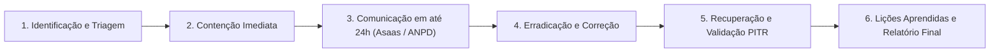

# Processo de Resposta a Incidentes de Segurança da Informação

## 1. Objetivo e Escopo
Este documento estabelece o protocolo oficial de identificação, triagem, contenção, erradicação, recuperação e comunicação de incidentes de segurança da informação no ecossistema AçaíFood, operado pela **Eletromecânica Baia Ltda** (CNPJ 42.035.623/0001-40).

## 2. Comunicação Obrigatória ao Asaas IP S.A.
> **REGRA CRÍTICA (Contrato BaaS - Cláusula de Segurança e Notificação):**
> Em qualquer incidente confirmado ou com suspeita razoável que envolva dados de subcontas, transações financeiras, credenciais de API, integridade de repasses Pix ou chaves criptográficas, o time de segurança da Eletromecânica Baia Ltda notificará formalmente o **Asaas IP S.A. no prazo máximo de 24 (vinte e quatro) horas** após a confirmação do evento.

- **Canais de Notificação Asaas:**
  - E-mail Oficial: `seguranca@asaas.com.br` / `suporte@asaas.com.br`
  - Portal de Atendimento: `https://www.asaas.com/ajuda`
  - Central de Suporte BaaS Dedicado: 0800 000 0000

## 3. Fases do Protocolo de Resposta

### 3.1 Identificação e Triagem
- Monitoramento de logs em `admin_audit_log`, `incident_logs` e `payout_failures`.
- Classificação por severidade:
  - **P0 (Crítica):** Vazamento de dados, violação de integridade financeira, suspeita de comprometimento de chaves de API Asaas ou Supabase service_role.
  - **P1 (Alta):** Indisponibilidade de rotas críticas de checkout ou liquidação.
  - **P2 (Média):** Falhas em fluxos auxiliares sem impacto financeiro direto.

### 3.2 Contenção Imediata
- Revogação e rotação instantânea de chaves de API (`ASAAS_API_KEY`, `SUPABASE_SERVICE_ROLE_KEY`, `INTERNAL_API_SECRET`).
- Bloqueio preventivo de subcontas ou contas de parceiros envolvidas via `api/user/status` (`status = 'blocked'`).
- Congelamento preventivo de liquidações automáticas (`settlements_enabled = false`).

### 3.3 Comunicação e Registro
- Notificação oficial ao Asaas em até 24h.
- Registro detalhado do incidente no `REGISTRO_DE_VULNERABILIDADES.md` e em `admin_audit_log`.

### 3.4 Erradicação e Correção
- Correção de código, aplicação de migration SQL com rollback testado.
- Reauditoria de RLS policies e RPCs de banco de dados.

### 3.5 Recuperação e Validação
- Se necessário, restauração via Supabase Point-in-Time Recovery (PITR).
- Execução da bateria de testes automatizados de regressão.

### 3.6 Lições Aprendidas
- Emissão de Relatório Pós-Incidente (Post-Mortem) em até 5 dias úteis com plano de ação preventivo.
